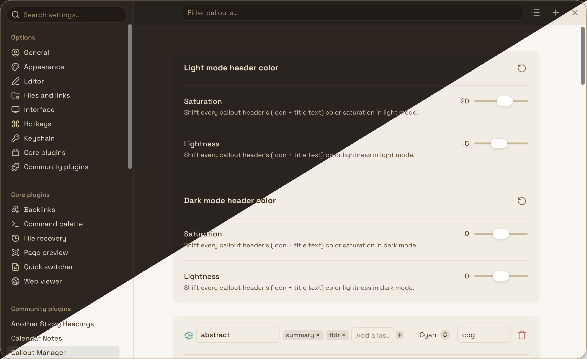

# Callout Manager (lhak fork)

An [Obsidian](https://obsidian.md) plugin for browsing, customizing, and creating [callouts](https://help.obsidian.md/callouts) — colors, icons, aliases, and a global header color adjuster.



This is a personal fork of [eth-p/obsidian-callout-manager](https://github.com/eth-p/obsidian-callout-manager), maintained for my own vault and workflow. It's diverged enough from upstream — architecture, UI, and feature set — that it should be treated as a separate plugin rather than a patched version of the original. It is **not** published to the community plugin store or npm; install it manually (below).

## Features

- **Browse and search your callouts.**
  Lists the callouts you've created through this plugin, with search and sort by name, color, or icon. There's no auto-discovery of Obsidian's built-in, theme-provided, or snippet-provided callouts — recreate the ones you want to style as custom callouts.

- **Edit color and icon inline.**
  Pick a color and set an icon (with autocomplete) directly from the list, no separate dialog.

- **Header color adjuster, per light/dark mode.**
  Global saturation/lightness sliders that shift every callout's icon + title color, independently for light and dark mode, with a one-click reset. Doesn't touch the callout body or border.

- **Alias groups.**
  Group callout IDs (e.g. `note`, `info`) so a color/icon change on the canonical callout propagates to its aliases.

- **Create and manage custom callouts.**
  Add, rename, and delete your own callout IDs from the same list.

- **Insert Callout command.**
  A command (and ribbon icon) that opens a searchable modal for inserting a callout at the cursor.

- **Plugin API.**
  Other plugins can query the callout list through a versioned API — see [api/README.md](./api/README.md). Note: this fork isn't published to npm, so consumers need to vendor or reference this repo directly rather than `npm install obsidian-callout-manager`.

## What changed from upstream

Most of the original settings UI (manage-plugin pane, CSS export, reset-to-defaults) was removed in favor of a single, denser manage-callouts pane, and the internals were restructured around a `CalloutStore` seam so panes don't depend on the plugin class directly. See the [commit history](https://github.com/lhak1341/obsidian-callout-manager/commits/master) for specifics — this fork doesn't keep a separate changelog.

## Installation

Not on the community plugin store. Either:

- **Manual:** download `main.js`, `styles.css`, and `manifest.json` from a [release](https://github.com/lhak1341/obsidian-callout-manager/releases) into `<vault>/.obsidian/plugins/callout-manager/`, then enable it in Obsidian's Community Plugins settings.
- **BRAT:** add this repo to [Obsidian42 - BRAT](https://github.com/TfTHacker/obsidian42-brat) as a beta plugin.

## Development

```bash
bun install
bun run test    # jest, 33 tests
bun run build   # typecheck + production bundle
bun run deploy  # build + copy into the vault configured in scripts/deploy.mjs
```

See [CLAUDE.md](./CLAUDE.md) for architecture notes and gotchas if you're working on this fork.

## License

MIT, © 2023 eth-p. See [LICENSE](./LICENSE).
